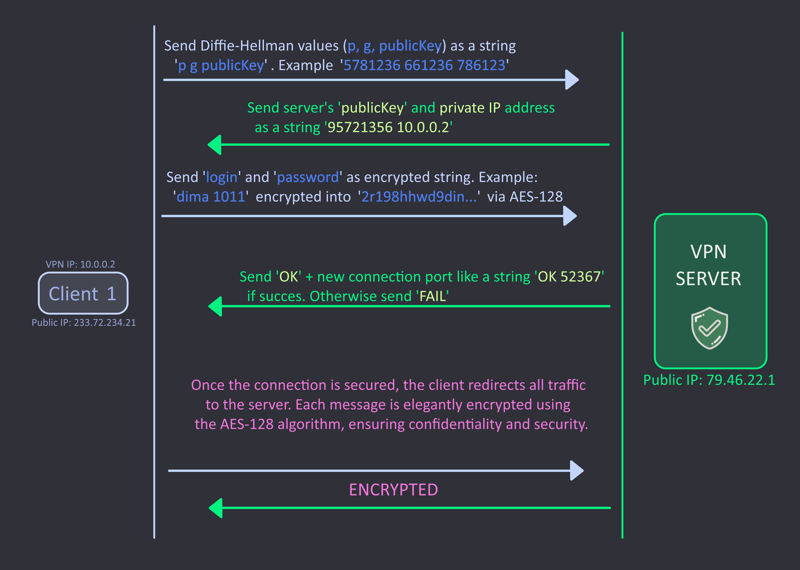

# Handshake protocol 🤝

**It is really important to make connection between client and server secured. That's why we use fancy stuff like the Diffie-Hellman algorithm, AES-128 encryption, and SHA256 hashing. It's all about keeping things secure! 🔒**

## Illustration diagram

## Client side handshake algorithm
- Generating Diffie-Hellman Values:
  - Generating `prime number (P)` and `primitive root (G)`.
  - Generating `client private` and ` client public` keys using the generated prime number and primitive root.
  - Constructing a string containing P, G, and the public key. Eg `'p g publicKey'`
- Send generated Diffie-Hellman string to the VPN server.
- Receiving Response:
  - Spliting the response to extract the `server public key` and `local IP` address.
- Calculating `shared secret` using the received `server public key`, `client private key`, and `prime number`.
- Calculating encryption key via SHA256 (To be honest, we use only 16 characters or 128 bits). Let's name it `sharedSecret`.
- Retrieving `login` and `password` from user.
- Encrypting authentication fields:
  - Constructing a string containing the login and password. Eg `'dima 1011'`.
  - Encrypting the authentication string via AES-128 using `sharedSecret` as a key.
- Sending encrypted authentication data to the server.
- Receiving server response:
  - Split the response to extract the status message `'OK'` and the `VPN service port`.
- Checking if response contains `OK`.

**Now the connection is secured.**

## Server side handshake algorithm
- Receiving Diffie-Hellman Values:
  - Receiving the generated Diffie-Hellman string containing `prime number (P)`, `primitive root (G)`, and `client public key`.
- Generating `server private key` and `server public key` using the received `prime number` and `primitive root`.
- Calculating `shared secret` using the received `client public key`, `server private key`, and `prime number`.
- Calculating encryption key via SHA256 (To be honest, we use only 16 characters or 128 bits). Let's name it `sharedSecret`.
- Sending `server public key` and assigned `virtual IP` to the client as a string. Eg `'21783685 10.0.0.2'`.
- Receiving client encrypted authentication string:
  - Decrypting string using the `sharedSecret`.
  - Extracting client `login` and `password`.
- Client authentication client:
  - Searching client in the database.
- Responding to the client with message which contains `OK` and  new random generated `VPNservice port` if client is authorized. Eg `'OK 7215'`. Otherwise respond `FAIL`.

**Now the connection is secured.**

## Secured connection
Once the connection is secure, all data exchanged between the client and server gets encrypted with the AES-128 and `sharedSecret` key, guaranteeing safety. The client then starts routing all traffic to the VPN server, while the server redirects it to its intended destinations, such as YouTube or other services.

