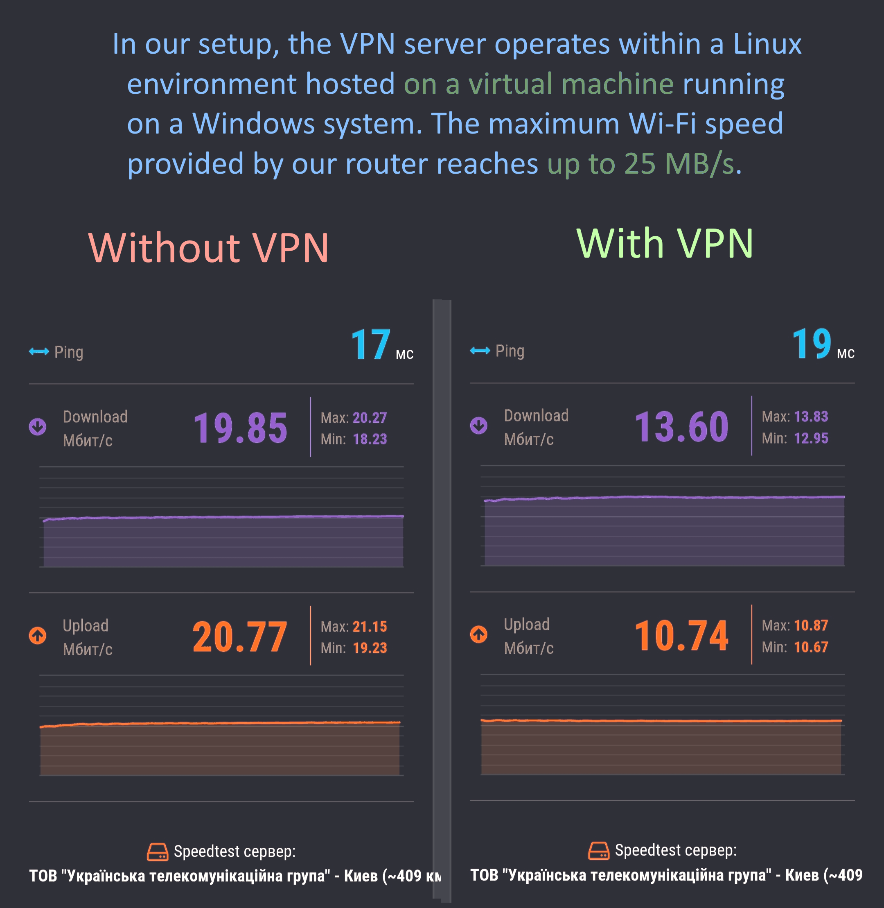

# Speed Testing

When it comes to evaluating network performance, conducting speed tests is essential. Speed tests help gauge the efficiency and reliability of your internet connection. Here's how you can perform speed tests:

## Tools and Methods

### 1. Online Speed Test Websites
There are numerous websites dedicated to conducting speed tests. Some popular options include:
- [Speedtest by Ookla](https://www.speedtest.net/)
- [Fast.com](https://fast.com/)
  
### 2. Built-in Router Tests
Many modern routers come equipped with built-in speed testing features. Check your router's documentation or admin interface to access this functionality.

## Conducting a Speed Test

1. **Select a Testing Method**: Choose one of the aforementioned tools or methods based on your preference and device compatibility.

2. **Initiate the Test**: Start the speed test tool or app. It will typically measure your download speed, upload speed, and ping latency.

3. **Analyze the Results**: Once the test is complete, review the results to assess your network performance. Look for:
   - Download Speed: The rate at which data is transferred from the internet to your device.
   - Upload Speed: The rate at which data is transferred from your device to the internet.
   - Ping Latency: The time it takes for a data packet to travel from your device to the test server and back. Lower ping values indicate better responsiveness.

## Speed Test Results
**Testing on Different Devices with Different Android Versions**:
- We conducted tests on a range of devices with varying Android versions to measure performance consistency. We noticed small variations, but newer devices might be faster because they're designed better and have improved software.

**Long-Term VPN Performance**:
- Our thorough testing, encompassing extensive usage in activities like gaming, browsing, and video streaming, underscores the VPN's steadfast and dependable performance. We maintained continuous VPN connections for several hours and left devices connected for a full day, verifying its uninterrupted operation and excellent functionality.

**Simultaneous Testing**: 
- Evaluating multiple devices concurrently provided insights into network performance under heavy usage. When there are multiple devices, they share maximum speed specified by your internet provider.

**Router Variance**: 
- Testing on diverse home routers with varying speeds unveiled the impact of hardware and configurations on performance. The maximum VPN speed is contingent upon the Wi-Fi version of your router and phone, as well as the maximum speed provided by your internet service provider.

**VPN speed test example**. We tested the speed on a mid-range phone. Keep in mind that the server runs on a virtual machine, so the actual performance should be higher. Additionally, the router's maximum Wi-Fi speed is 25 Mb/s, while the internet provider's maximum is 100 Mb/s.

In our setup, after conducting 10 tests at various times, we noticed a decrease in maximum speed by around 20-30% on a router with a maximum speed of 25 MB/s.

Conversely, when testing on a router with a speed of 300 Mb/s, we observed significantly higher results.

## Conclusion
While VPN may experience a slight decrease in speed, it offers numerous benefits such as enhanced security, anonymity, and privacy.