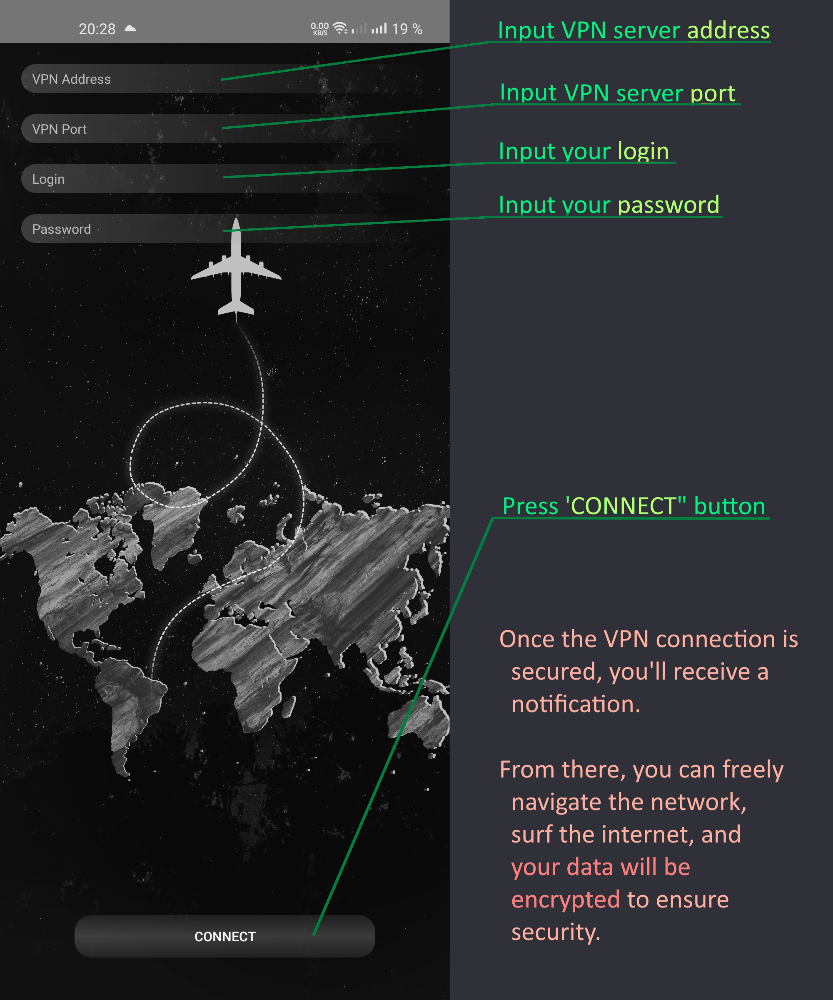

# The AVPN user guide
This pages describes how to install and use android AVPN application.

## Installation 
Simply execute `'avpn.apk'` file, then select `'install`'. Now you can start your program and configure connection.

## Usage
**Launch app using icon**

**Next you will see main page**

## Connection
To estabilish VPN connection you need to make some steps:
- Input VPN server `IP address`.
- Input VPN server `port`.
- Input `login`.
- Input `password`.
- Press button `'CONNECT'`.

You will be notified about connection status. It could be:
- `Connecting...`: This message indicates that the system is actively attempting to establish a connection with the server. If the connection isn't established within `10 seconds`, a timeout will occur.
- `Failed to connect!`: This notification suggests that there may be issues with the provided credentials such as `server IP`, `server port`, `login`, `password`, or it's possible that the server itself is encountering difficulties.
- `VPN Service started`: Upon successfully establishing a connection, this message will confirm that your VPN service is now operational and your network activity is securely encrypted. You're all set to browse the web with confidence.

## Disconnecting
To disconnect, simply click the `DISCONNECT` button, and your VPN will be promptly deactivated, restoring your network to its original state.
